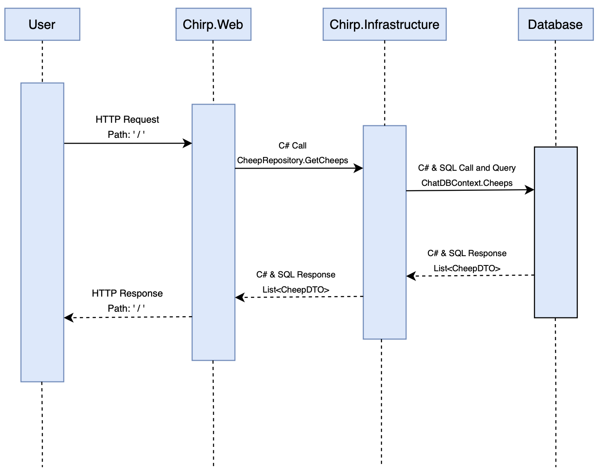
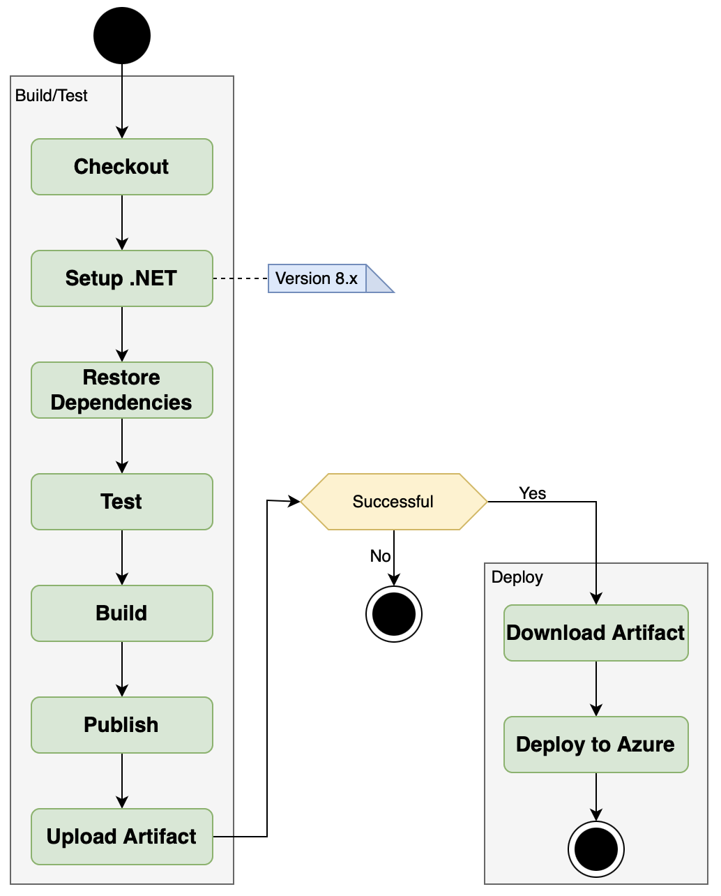

\newpage

# Design and Architecture of Chirp!

## Domain model

The UML class diagram above provides an overview of the core domain model for our _Chirp!_ application, highlighting the primary entities, their attributes, and the relationships between them. 

A key aspect of the diagram is the cardinality between the entities, which defines how objects in one class relate to objects in another.

\newpage

## Architecture — In the small 

The union architecture diagram above visually represents the layered structure of the Chirp! application. The diagram consists of three circles with a different shade of blue, each symbolizing one of the core architectural layers: Core, Infrastructure, and Web. The components within each circle represent the key parts or responsibilities of that layer.

The arrows throughout the diagram represent the unidirectional dependency flow of the application, where each layer depends only on the layers inside of itself: 

* The Core layer is independent and does not depend on any outer layer.

* The Infrastructure layer relies on the Core while still remaining separate from the Web layer. 
\newpage
* The Web layer depends on both the Infrastructure and Core layers to deliver functionality to the user.

This layered structure ensures separation of concerns, making the program easily maintainable, testable, and scalable. Each layer can be adjusted, without having a direct impact on the logic and functionality of the layers above it. 

## Architecture of deployed application

Above is a diagram that illustrates the architecture of our deployed Chirp! application which focuses on the client-server relation.
\newpage

## User activities
The following two figures illustrate distinct user journeys through the Chirp! application, tailored for both unauthorized users(not logged in) and authorized users (logged in). Each figure maps out two specific journeys, showing how users can interact with the system's key features.

### Unauthorized Journey

This diagram focuses on the experience of users who are not logged into the system.

The user journey on the left, “Browsing”, highlights the program's accessibility for unauthenticated users, allowing them to explore content without having to register first. 
The user can navigate the public timeline as well as other authenticated users timelines.

The user journey on the right, “Register”, emphasizes the application’s user-friendly onboarding process, using GitHub OAuth for convenience and ensuring new users can easily register as a user in the system. After registering the user is automatically logged in and navigated to the public timeline. 

### Authorized Journey

In contrast to the previous figure, this diagram depicts the program's accessibility for a user who is already registered with the Chirp! application. 

The user journey on the left, “Login”, showcases the login process of an authenticated user, ensuring easy access to the full functionality of the program by allowing users to login with both username and email as well as a separate GitHub option.

The user Journey on the right, “Browsing”, highlights the interactive features available to logged-in users, such as posting content and engaging with their own timeline, which form the core functionality of the Chirp! application.

## Sequence of functionality/calls trough Chirp!

The diagram above shows the sequence of functionality from when an unauthenticated user sends a HTTP GET request to the root endpoint of our application (/) until the server responds with a fully rendered HTML page.
\newpage

# Process

## Build, test, release, and deployment
### Build and Test
{height=400px}

The diagram above shows our GitHub Actions workflow for building and testing the _Chirp!_ application. The workflow runs when code is pushed to the main branch or a pull request targets it.

It starts by checking out the repository and setting up .NET version 8.x. The dependencies are restored, and the application is built. Tests are then executed, ensuring both functional and browser-based components work as expected.

This workflow ensures new changes do not break the build or tests.
\newpage

### Release

{height=450px}

The diagram above illustrates our _Chirp!_ release workflow, which runs when a tag matching the format v* is pushed to GitHub. This triggers the process to build, test, and release the application.

The workflow starts with Checkout and setting up .NET version 8.x. It restores dependencies, runs unit tests, and builds the project for deployment. The application is then published, zipped, and a GitHub release is created. Finally, the zipped build is uploaded as a release asset, allowing it to be downloaded and deployed.

This ensures that every tagged release is thoroughly tested and packaged for distribution.
\newpage

### Deploy

{height=450px}

The diagram above shows the Build and Deploy workflow for our _Chirp!_ application. It runs on pushes to the main branch or manual triggers.
The workflow builds, tests, and deploys the application in two steps:

* Build and Test: The code is checked out, dependencies are restored, unit tests are run, and the application is built and published as an artifact.

* Deploy: The artifact is downloaded and deployed to the Production environment on Azure.

This keeps our application up to date and ensures it works before deployment.

\newpage

## Team work

## How to make Chirp! work locally

## How to run test suite locally

# Ethics

## License

## LLMs, ChatGPT, CoPilot, and others