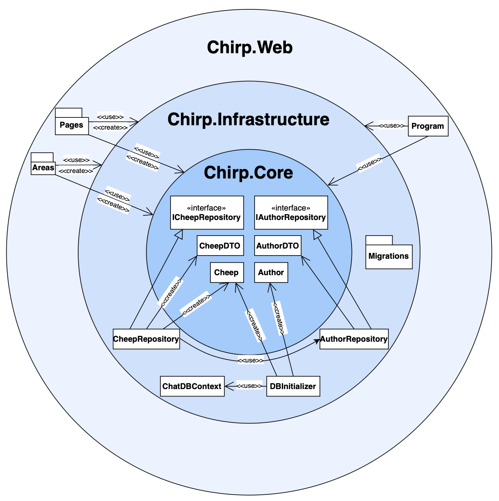

# Design and Architecture of Chirp!

## Domain model

The UML class diagram above provides an overview of the core domain model for our _Chirp!_ application, highlighting the primary entities, their attributes, and the relationships between them. A key aspect of the diagram is the cardinality between the entities, which defines how objects in one class relate to objects in another.

## Architecture — In the small 

The union architecture diagram above visually represents the layered structure of the Chirp! application. The diagram consists of three circles with a different shade of blue, each symbolizing one of the core architectural layers: Core, Infrastructure, and Web. The components within each circle represent the key parts or responsibilities of that layer.
The arrows throughout the diagram represent the unidirectional dependency flow of the application, where each layer depends only on the layers inside of itself: 

* The Core layer is independent and does not depend on any outer layer.

* The Infrastructure layer relies on the Core while still remaining separate from the Web layer.

* The Web layer depends on both the Infrastructure and Core layers to deliver functionality to the user.

This layered structure ensures separation of concerns, making the program easily maintainable, testable, and scalable. Each layer can be adjusted, without having a direct impact on the logic and functionality of the layers above it. 

## Architecture of deployed application

## User activities

## Sequence of functionality/calls trough Chirp!

# Process

## Build, test, release, and deployment

## Team work

## How to make Chirp! work locally

## How to run test suite locally

# Ethics

## License

## LLMs, ChatGPT, CoPilot, and others