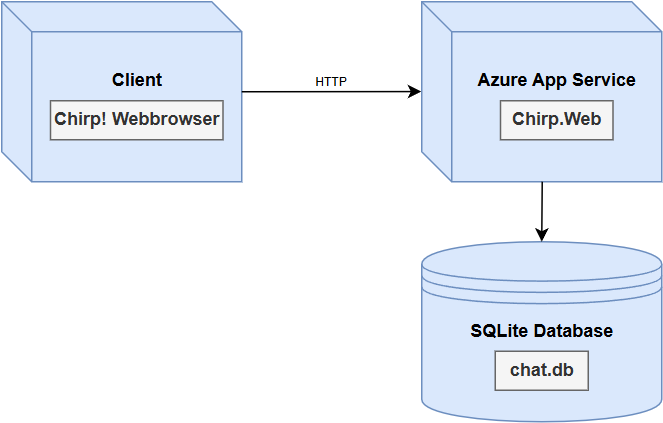
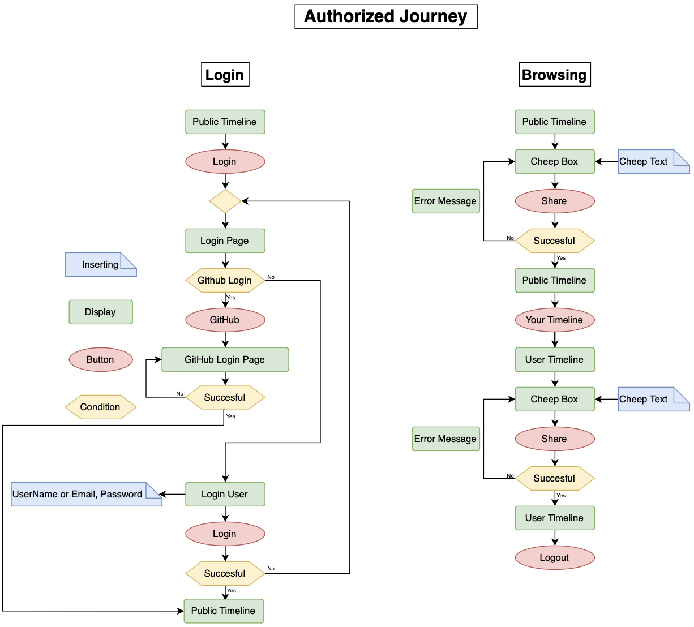
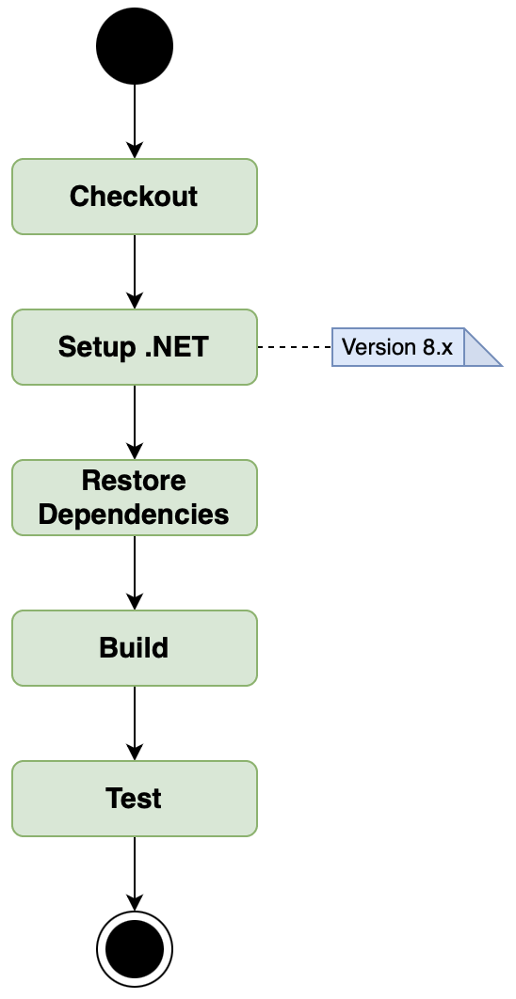

\newpage

# Design and Architecture of Chirp!

## Domain model


The UML class diagram above, provides an overview of the core domain model for our _Chirp!_ application, highlighting the primary entities, their attributes, and the relationships between them. 

A key aspect of the diagram is the cardinality between the entities, which defines how objects in one class relate to objects in another.

\newpage

## Architecture — In the small 
{height=550px}

The union architecture diagram above, visually represents the layered structure of the Chirp! application. The diagram consists of three circles with a different shade of blue, each symbolizing one of the core architectural layers: Core, Infrastructure, and Web. The components within each circle represent the key parts or responsibilities of that layer.

The arrows throughout the diagram represent the unidirectional dependency flow of the application, where each layer depends only on the layers inside of itself: 

* The Core layer is independent and does not depend on any outer layer.

* The Infrastructure layer relies on the Core while still remaining separate from the Web layer. 

* The Web layer depends on both the Infrastructure and Core layers to deliver functionality to the user.

This layered structure ensures separation of concerns, making the program easily maintainable, testable, and scalable. Each layer can be adjusted, without having a direct impact on the logic and functionality of the layers above it. 

## Architecture of deployed application


Above, is a diagram that illustrates the architecture of our deployed Chirp! application which focuses on the client-server relation.
\newpage

## User activities
The following two figures illustrate distinct user journeys through the Chirp! application, tailored for both unauthorized users(not logged in) and authorized users (logged in). Each figure maps out two specific journeys, showing how users can interact with the system's key features.

### Unauthorized Journey
{height=550px}


This diagram focuses on the experience of users who are not logged into the system.

The user journey on the left, “Browsing”, highlights the program's accessibility for unauthenticated users, allowing them to explore content without having to register first. 
The user can navigate the public timeline as well as other authenticated users' timelines.

The user journey on the right, “Register”, emphasizes the application’s user-friendly onboarding process, using GitHub OAuth for convenience and ensuring new users can easily register as a user in the system. After registering the user is automatically logged in and navigated to the public timeline. 

### Authorized Journey


In contrast to the previous figure, this diagram depicts the program's accessibility for a user who is already registered with the Chirp! application. 

The user journey on the left, “Login”, showcases the login process of an authenticated user, ensuring easy access to the full functionality of the program by allowing users to login with both username and email as well as a separate GitHub option.

The user Journey on the right, “Browsing”, highlights the interactive features available to logged-in users, such as posting content and engaging with their own timeline, which form the core functionality of the Chirp! application.

\newpage

## Sequence of functionality/calls trough Chirp!


The diagram above shows the sequence of functionality from when an unauthenticated user sends a HTTP GET request to the root endpoint of our application (/) until the server responds with a fully rendered HTML page.
\newpage

# Process

## Build, test, release, and deployment
### Build and Test
{height=400px}

The diagram above shows our GitHub Actions workflow for building and testing the _Chirp!_ application. The workflow runs when code is pushed to the main branch or a pull request targets it.

It starts by checking out the repository and setting up .NET version 8.x. The dependencies are restored, and the application is built. Tests are then executed, ensuring both functional and browser-based components work as expected.

This workflow helps maintain stability by verifying that all components work correctly after each change.
\newpage

### Release

{height=450px}

The diagram above illustrates our _Chirp!_ release workflow, which runs when a tag matching the format v* is pushed to GitHub. This triggers the process to build, test, and release the application.

The workflow starts with Checkout and setting up .NET version 8.x. It restores dependencies, runs unit tests, and builds the project for deployment. The application is then published, zipped, and a GitHub release is created. Finally, the zipped build is uploaded as a release asset, allowing it to be downloaded and deployed.

This ensures that every tagged release is thoroughly tested and zipped for distribution.
\newpage

### Deploy

{height=450px}

The diagram above shows the Build and Deploy workflow for our _Chirp!_ application. It runs on pushes to the main branch or manual triggers.
The workflow builds, tests, and deploys the application in two steps:

* Build and Test: The code is checked out, dependencies are restored, unit tests are run, and the application is built and published as an artifact.

* Deploy: The artifact is downloaded and deployed to the Production environment on Azure.

This keeps our application up to date and ensures it works before deployment.

\newpage

## Team work
### Tasks and Issues
{height=530px}

The diagram above illustrates how we managed tasks and issues throughout the development process. At the start of each week, all requirements were broken into separate issues and moved to the “_Todo_” column.

For most issues, the team worked together since tasks were often sequentially dependent. This meant that starting a later issue simultaneously was not feasible. However, when possible, we split the group into two teams to work on independent issues. In such cases, two branches were created, and both teams worked separately to resolve their tasks. Once finished, the branches were merged into one and thoroughly tested to ensure that no conflicts or functionality issues occurred. If all tests passed, the merged branch was integrated into the main branch, and the related issues were moved to “_Done_”.

This approach allowed us to maintain stability in the main branch, while effectively resolving multiple issues in parallel when the tasks permitted it.
\newpage


### Project Board


The project board screenshot shows its state right before hand-in. The board is divided into four columns: Todo, In Queue/Temporarily Paused, In Progress, and Done.

The empty Todo and In Progress columns reflect that all planned features are complete, and no unresolved tasks remain. This organization ensured a clear workflow and efficient tracking of progress throughout development.
\newpage

## How to make Chirp! work locally
**1. Clone the repository**

Firstly, open a command prompt. From here, navigate to the folder in which you want the project to be, and run the command:

```  console
git clone https://github.com/ITU-BDSA2024-GROUP6/Chirp.git
``` 
\
**2. GitHub OAuth**

Now create a Github OAuth app via https://github.com/settings/developers
Click New OAuth app and fill in the details. The homepage URL should be: 

"http://localhost:5273/"

\
and the callback URL should be

"http://localhost:5273/signin-github"

\
You should now take note of the client ID, you will need this in a second. This can be found on the apps page.
\

**3. Secrets**

Now you need to generate a secret, take note/copy of the client secret as well, this is done on the same page.
You need this to set the Development Secrets.
\

Now add the user-secrets with the following commands:

``` console
dotnet user-secrets init
``` 

``` console
dotnet user-secrets set "authentication:github:clientId" "<YOUR_CLIENTID>"
``` 

``` console
dotnet user-secrets set "authentication:github:clientSecret" "<YOUR_CLIENTSECRET>"
``` 
\
**4. Run the program**

Then, navigate to the root directory “_Chirp_”, where you just cloned the repository to.
Then navigate to the Chirp.Web folder with the following command:

``` console
cd src/Chirp.Web
``` 
\
Then start the application by running the command:

``` console
dotnet run
``` 
\newpage
You should see the following in the terminal:


**5. Open browser**

Click the url http://localhost:5273 or copy it into the addressbar in your browser.
This will open our Chirp Client which you can now browse through as you wish.

\newpage

## How to run test suite locally
You will need to have Playwright installed, which you, if you have not already, can do by following this guide: https://playwright.dev/docs/getting-started-vscode

Once you have installed Playwright, the tests are now ready to run.

In the terminal, navigate to the root directory (/Chirp) of the project and run the command: 

``` console
dotnet test
```

### Coverage
Our test suite covers unit tests, UI tests, and an end-to-end (E2E) test to ensure reliability and correctness across different parts of the Chirp! application.

**Unit Tests**:

* AuthorRepositoryTests
Tests for core author operations, including retrieving authors by name, email, and ID, following/unfollowing authors, and verifying follower relationships.

* CheepRepositoryTests
Tests cheep operations such as creating cheeps, retrieving cheeps by author, and fetching cheeps from followed users.

**UI Tests**:

Using Playwright, these tests verify functionality for both authenticated and unauthenticated users.

**End-to-End Test**:

A single comprehensive Playwright test that verifies the full user journey.

Together, these tests ensure that individual components function correctly, UI interactions work seamlessly, and the system behaves as expected end-to-end.
\newpage


# Ethics

## License

We chose the MIT License for our application. This license is simple and permissive, allowing others to freely use, modify, and distribute the software for both private and commercial purposes. 

Additionally, the license includes a disclaimer stating that the software is provided "as is," without any warranty, ensuring that we are not liable for any issues arising from its use.

## LLMs, ChatGPT, CoPilot, and others

We used ChatGPT and Claude as supporting tools during the development of our project.

At the start, we encountered new concepts such as C# and Razor Pages, which required further clarification. ChatGPT was particularly helpful in explaining terms and topics we did not fully understand. For tasks involving specific principles like command-query separation, we used LLMs to generate examples. These examples provided a clearer understanding of the required structure and helped us approach tasks more effectively.

The use of ChatGPT and Claude streamlined our workflow by acting as a precise alternative to traditional search engines. Instead of manually reviewing multiple articles, the LLMs provided targeted information, which we fact-checked to ensure accuracy. This significantly reduced the time spent on searching and allowed us to focus on implementation.

Overall, the LLMs improved our efficiency and understanding, speeding up development. While the responses were usually correct, there were rare cases of generic or incorrect answers that caused minor delays. Despite this, their contribution was valuable in enhancing both the pace and quality of our work.
